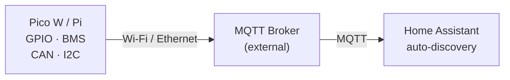

# mqttpi

**MQTT GPIO & sensor bridge for Raspberry Pi and Pico W — Home Assistant compatible by default.**

Configure pins, buses, and sensors in YAML; publish to an external MQTT broker with automatic [Home Assistant](https://www.home-assistant.io/) discovery.



**Repository:** [github.com/carefreeinv/mqttpi](https://github.com/carefreeinv/mqttpi)

**Documentation:** [carefreeinv.github.io/mqttpi](https://carefreeinv.github.io/mqttpi/)

## Features

- **Pico W first** — flexible PWM mux, ADC, Wi-Fi; Pi 4/5 for serial/CAN/audio-heavy nodes
- **YAML config** — `config.yaml` + gitignored `secrets.yaml` (credentials merged at runtime)
- **HA by default** — discovery on, `ON`/`OFF` payloads, retained state topics
- **Optional buses** — enable only what you need: 1-Wire, I2C, SPI, I2S, PWM
- **Rich examples** — 36 configs with paired docs ([`examples/README.md`](examples/README.md))
- **JBD BMS** — wired UART monitor 
- **Site templates** — RV, cargo trailer, semi, skoolie, house, makerspace zones, robot, 32-relay bank, …

## Status (v0.2.0)

| Component | Status |
|-----------|--------|
| Config schema & examples | Ready |
| Unified daemon (`python3 -m mqttpi`) | **Implemented** — GPIO outputs/inputs + optional BMS |
| JBD BMS → MQTT → HA | **Implemented** (daemon or `mqttpi.bms.bridge`) |
| PWM / CAN / I2C expanders / Victron | Config contract — not in daemon yet |

## Quick start

### 1. Clone

```bash
git clone https://github.com/carefreeinv/mqttpi.git
cd mqttpi
pip3 install -r requirements.txt
```

### 2. Pick an example

```bash
# Starter example — see examples/README.md for site templates and more
cp examples/digital-in-out.yaml config.yaml

cp secrets.example.yaml secrets.yaml
```

Edit `device.id`, `mqtt.host`, and `secrets.yaml`.

### 3. Run the daemon

```bash
# 16 relays (GPIO outputs)
cp examples/relay-bank-16.yaml config.yaml

# Or BMS only (Pi + JBD UART)
cp examples/jbd-bms.yaml config.yaml

# Foreground — stays running until Ctrl+C
python3 -m mqttpi -v

# BMS UART test without the full daemon loop
python3 -m mqttpi.bms.bridge --once -v
```

See [daemon.md](daemon.md) for subsystem details, `--mock-gpio`, and optional systemd setup (not installed by default).

### 4. Home Assistant

Enable the **MQTT** integration with **discovery** enabled. Entities appear after the bridge publishes `homeassistant/*/config`.

## Configuration

| File | Tracked | Purpose |
|------|---------|---------|
| `config.example.yaml` | Yes | Empty starter template |
| `config.yaml` | **No** (gitignored) | Your device wiring & IDs |
| `secrets.yaml` | **No** (gitignored) | `mqtt.username`, `mqtt.password` |
| `secrets.example.yaml` | Yes | Template |

### Topic layout (default)

```
{base_topic}/gpio/{alias}/state    ← inputs, sensors
{base_topic}/gpio/{alias}/set      ← outputs, PWM commands
{base_topic}/bms/...               ← JBD BMS (when enabled)
{base_topic}/status                ← online / offline
```

### Pico W pin budget

| Profile | Free GPIO (typical) |
|---------|---------------------|
| `maximum_gpio` (default) | **23** pins |
| + PWM bank only | 15 pins + 8 PWM |
| + I2C | −2 pins (GP0/1) |

**32 relays** on Pico W requires **2× MCP23017** I2C expanders (16 GPIO per chip) — see [`examples/relay-bank-32.yaml`](examples/relay-bank-32.yaml).

## Examples

| Category | Index |
|----------|-------|
| All examples + docs | [`examples/README.md`](examples/README.md) |
| Site / vehicle templates | [`examples/sites/`](examples/sites/) |
| 32 relays (2× MCP23017) | [`examples/relay-bank-32.md`](examples/relay-bank-32.md) |
| 8-zone speakers | [`examples/speaker-zones-8.md`](examples/speaker-zones-8.md) |
| Robot rover | [`examples/robot.md`](examples/robot.md) |
| JBD BMS | [`examples/jbd-bms.md`](examples/jbd-bms.md) |

Each `*.yaml` has a matching `*.md` with wiring, FAQ, and design decisions.

## Project layout

```
mqttpi/
├── README.md
├── CHANGELOG.md
├── LICENSE
├── config.example.yaml
├── secrets.example.yaml
├── requirements.txt
├── mqttpi/              # Python package
│   ├── daemon.py        # Unified GPIO + BMS daemon
│   ├── gpio/            # Relay/sensor GPIO subsystem
│   ├── mqtt/            # Shared MQTT client
│   └── bms/             # JBD UART subsystem
├── examples/            # YAML + markdown docs
├── projects/            # Deployment guides
│   ├── cargo-trailer/
│   ├── house/
│   ├── store/
│   └── makerspace/
├── mqttpi.service       # systemd template (manual install)
└── mqttpi-bms.service   # BMS-only systemd template
```

## Hardware notes

- **Logic level:** 3.3 V — use level shifters / optocouplers for 12 V trailer and vehicle signals
- **Relays / motors:** always via driver boards — GPIO cannot sink/source load current
- **Victron:** VE.Direct (UART) ≠ VE.Can (NMEA 2000) ≠ RV-C — separate decoders
- **CAN on Pico W:** MCP2515 SPI or [can2040](https://github.com/KevinOConnor/can2040) + transceiver

## Development

```bash
# GPIO daemon (no broker needed for import check)
PYTHONPATH=. python3 -m mqttpi -c examples/relay-bank-16.yaml --mock-gpio -v

# BMS bridge tests (no BMS attached → expect serial timeout)
PYTHONPATH=. python3 -m mqttpi.bms.bridge -c examples/jbd-bms.yaml --once -v

# Documentation site (https://carefreeinv.github.io/mqttpi/)
pip3 install -r requirements-docs.txt
python3 scripts/stage_docs.py
mkdocs serve
```

See [CHANGELOG.md](CHANGELOG.md) for release history.

## License

MIT — see [LICENSE](LICENSE).

## Acknowledgments

- JBD protocol reference: [esphome-jbd-bms](https://github.com/syssi/esphome-jbd-bms)
- Pinout reference: [pinout.xyz](https://pinout.xyz)
