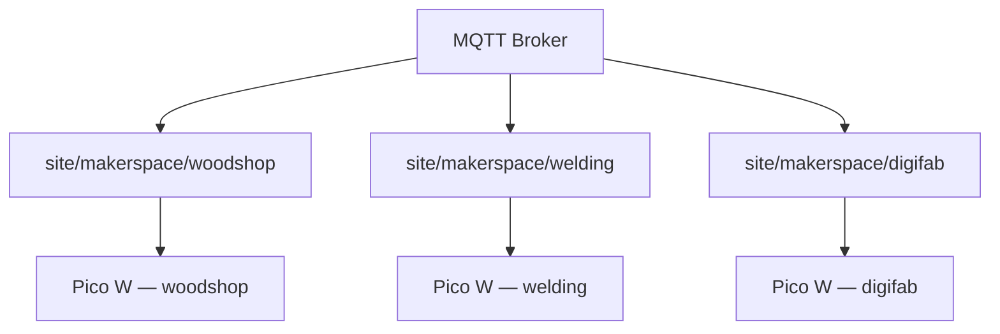

# Makerspace deployment

This guide walks through deploying the makerspace site templates — **one Pico W node per shop zone**.

**Configs:**

| Zone | Config | Documentation |
|------|--------|---------------|
| Woodshop | [`makerspace-woodshop.yaml`](../examples/sites/makerspace-woodshop.yaml) | [`makerspace-woodshop.md`](../examples/sites/makerspace-woodshop.md) |
| Welding | [`makerspace-welding.yaml`](../examples/sites/makerspace-welding.yaml) | [`makerspace-welding.md`](../examples/sites/makerspace-welding.md) |
| Digifab | [`makerspace-digifab.yaml`](../examples/sites/makerspace-digifab.yaml) | [`makerspace-digifab.md`](../examples/sites/makerspace-digifab.md) |

**Overview:** [`makerspace.md`](../examples/sites/makerspace.md)

## Hardware

| Item | Notes |
|------|-------|
| Board | **Raspberry Pi Pico W** — one per zone |
| Config templates | `makerspace-woodshop.yaml`, `makerspace-welding.yaml`, `makerspace-digifab.yaml` |
| RFID reader | PN532 on I2C (GP0/GP1), IRQ on GP7 |
| Logic level | 3.3 V — relay modules for machine outlets and ventilation |

Deploy one dedicated Pico W per shop area. GPIO and relay count stays within Pico W limits; a fault in one zone does not take down the whole facility.

## Architecture



## Setup checklist

Repeat for each zone (woodshop, welding, digifab):

1. [ ] Flash or install mqttpi on a **dedicated Pico W** for the zone.
2. [ ] Wire PN532 RFID reader on I2C (SDA GP0, SCL GP1, IRQ GP7).
3. [ ] `cp examples/sites/makerspace-<zone>.yaml config.yaml`
4. [ ] `cp secrets.example.yaml secrets.yaml` — set broker host and credentials.
5. [ ] Confirm `device.id` and `mqtt.base_topic` are unique per zone (pre-set in examples).
6. [ ] Wire machine outlets, ventilation, and lighting through relay modules.
7. [ ] Test with `poll_interval` / dry-run before enabling retained command topics.
8. [ ] Verify zone entities in Home Assistant after discovery payloads publish.
9. [ ] Configure HA automations for cross-zone rules (dust-before-saw, laser interlocks, RFID access).

## Entities — Woodshop

| HA entity | GPIO | Role |
|-----------|------|------|
| `binary_sensor.shop_door` | GP6 | Woodshop door contact |
| `binary_sensor.motion_shop` | GP20 | Shop motion |
| `switch.dust_collector` | GP21 | Dust collector |
| `switch.table_saw_power` | GP22 | Table saw outlet |
| `switch.planer_power` | GP2 | Planer outlet |
| `switch.bandsaw_power` | GP3 | Bandsaw outlet |
| `switch.shop_overhead` | GP4 | Overhead lights |
| `switch.bench_lights` | GP5 | Bench accent |
| `number.overhead_dim` | GP8 (PWM) | Overhead dimmer |
| `sensor.shop_temp` | GP26 (ADC) | Shop temperature |
| RFID | I2C | Woodshop entry reader |

## Entities — Welding

| HA entity | GPIO | Role |
|-----------|------|------|
| `binary_sensor.shop_door` | GP6 | Welding shop door |
| `binary_sensor.motion_shop` | GP20 | Shop motion |
| `switch.fume_extractor` | GP21 | Fume extractor |
| `switch.make_up_air` | GP22 | Make-up air fan |
| `switch.welder_outlet_1` | GP2 | Welder outlet 1 |
| `switch.welder_outlet_2` | GP3 | Welder outlet 2 |
| `switch.grinding_power` | GP4 | Grinding area outlet |
| `switch.shop_overhead` | GP5 | Overhead lights |
| `number.overhead_dim` | GP8 (PWM) | Overhead dimmer |
| `sensor.shop_temp` | GP26 (ADC) | Shop temperature |
| RFID | I2C | Welding entry reader |

## Entities — Digifab

| HA entity | GPIO | Role |
|-----------|------|------|
| `binary_sensor.laser_room_door` | GP6 | Laser room door |
| `binary_sensor.motion_lab` | GP20 | Lab motion |
| `switch.laser_exhaust` | GP21 | Laser exhaust |
| `switch.laser_power` | GP22 | Laser cutter outlet |
| `switch.printer_bench` | GP2 | 3D printer bench |
| `switch.vinyl_cutter` | GP3 | Vinyl cutter outlet |
| `switch.lab_overhead` | GP4 | Lab overhead lights |
| `switch.electronics_bench` | GP5 | Electronics bench |
| `number.lab_dim` | GP8 (PWM) | Lab dimmer |
| `sensor.lab_temp` | GP26 (ADC) | Lab temperature |
| RFID | I2C | Digifab entry reader |

## MQTT namespace

Each zone publishes under its own base topic:

```
site/makerspace/woodshop/gpio/<alias>/state
site/makerspace/woodshop/gpio/<alias>/set
site/makerspace/woodshop/rfid/scan
site/makerspace/woodshop/status

site/makerspace/welding/...
site/makerspace/digifab/...
```