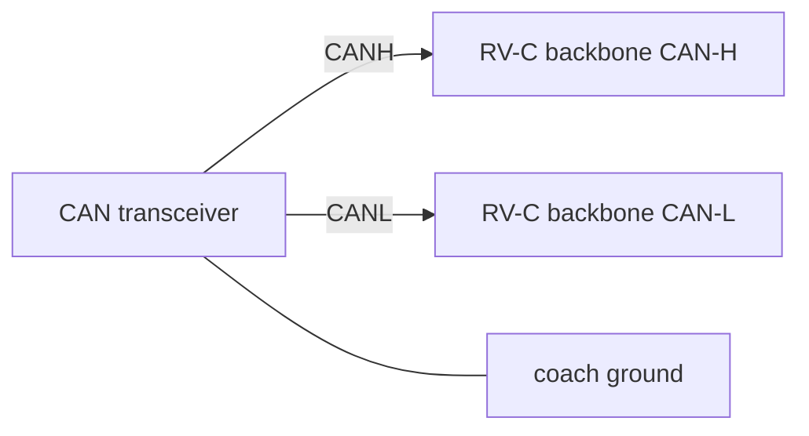

# CAN RV-C — read/write coach bus gateway

## Purpose

Bridge an **RV-C** (Recreational Vehicle-CAN) network at **250 kbit/s** to MQTT and Home Assistant. **Read** tank levels, interior temperature, and status PGNs; **write** dimmer, relay, and HVAC commands on certified RV-C coaches.

RV-C is a **separate protocol** from Victron VE.Can and from vehicle OBD — same physical CAN wiring style, different PGN map and addressing rules.

## Quick start

```bash
cp examples/can-rvc.yaml config.yaml
cp secrets.example.yaml secrets.yaml
# Edit mqtt.host, source_address if needed
# MCP2515 on SPI0 + transceiver → RV-C CAN-H / CAN-L
```

**Important:** Only attach to buses you own or have permission to control. `mode: read_write` can change lights and HVAC on a live coach network.

Pair with [`sites/rv.yaml`](sites/rv.yaml) for GPIO not covered by RV-C, or run standalone on an RV-C-only node.

## Hardware

| Item | Spec |
|------|------|
| **Board** | Raspberry Pi Pico W (`profile: sensors`) |
| **CAN controller** | MCP2515 on SPI0 (or **can2040** — [`can-can2040.md`](can-can2040.md)) |
| **Transceiver** | TJA1050 / SN65HVD230 / MCP2551 |
| **Bitrate** | **250000** (RV-C standard) |
| **Frame format** | **Extended** 29-bit IDs (J1939-family PGNs) |
| **Mode** | **read_write** (required for command PGNs) |

### MCP2515 wiring (same as other SPI examples)

| Signal | GPIO |
|--------|------|
| SCK / MOSI / MISO | GP2 / GP3 / GP4 |
| CS | GP5 |
| INT | GP6 |

### RV-C addressing

| Setting | Value |
|---------|-------|
| `source_address` | `0x80` (example; must not collide) |
| `address_claim` | `dynamic` (J1939 address claim on boot) |

## Bus wiring



Optional **120 Ω** termination at this node only if it is a bus end (`termination_ohm: 120`).

RV-C runs on the **coach house network** — often near the fuse panel or multiplex control center. It is **not** the same tap as:

- **Vehicle OBD** @ 500k ([`can-vehicle.md`](can-vehicle.md))
- **Victron VE.Can** @ 250k NMEA 2000 ([`victron-vecan.md`](victron-vecan.md))

Many high-end rigs have **both** Victron energy gear (VE.Direct / VE.Can) **and** a separate RV-C segment for lighting/HVAC. A Cerbo GX bridges them; mqttpi can mirror that with two configs.

## MQTT / Home Assistant topics

Default `base_topic`: `mobile/rvc-gateway-01`  
Payload on/off: **ON** / **OFF** (from `mqtt.payload_on` / `payload_off`)

### Listen (read from bus → HA sensors)

| Alias | PGN | HA entity | Unit |
|-------|-----|-----------|------|
| `fresh_tank_level` | `0x1FFB9` | Fresh Tank Level (RVC) | % |
| `grey_tank_level` | `0x1FFBB` | Grey Tank Level (RVC) | % |
| `black_tank_level` | `0x1FFBD` | Black Tank Level (RVC) | % |
| `interior_temp` | `0x1FEDA` | Interior Temp (RVC) | °C |

State pattern: `{base_topic}/sensors/{alias}/state` (retained)

### Command (HA → bus write)

| Alias | PGN | Type | HA entity |
|-------|-----|------|-----------|
| `ceiling_light` | `0x1FFD8` | dimmer (instance 0) | Ceiling Light (RVC) 0–100 |
| `accent_light` | `0x1FFD8` | dimmer (instance 1) | Accent Light (RVC) 0–100 |
| `hvac_mode` | `0x1FFD9` | enum (instance 0) | HVAC Mode (RVC) |

Command topic pattern (contract): `{base_topic}/rvc/{alias}/set`  
State feedback: `{base_topic}/rvc/{alias}/state`

### Home Assistant discovery

- Listen PGNs → `sensor` entities with `state_class: measurement`
- Dimmer commands → `number` or `light` (runtime choice) with min/max 0–100
- HVAC enum → `select` or `climate` helper

Device: **RV-C Gateway**

## Design decisions

1. **250k extended only** — Matches RV-C spec; do not use OBD 500k settings on this bus.
2. **read_write mode** — RV-C lighting and HVAC control requires transmitting command PGNs with correct source address and instance fields.
3. **Dynamic address claim** — Avoids static address clashes when multiple controllers power up.
4. **Instance field per device** — Same PGN `0x1FFD8` distinguishes ceiling vs accent dimmers via `instance`.
5. **Explicit separation from Victron** — VE.Can shares bitrate/physical layer but **different protocol** — RV-C decoders must not be pointed at a Victron bus without `protocol: vecan`.
6. **MCP2515 first** — Same BOM as [`can-vehicle.yaml`](can-vehicle.yaml); swap backend to can2040 if you need fewer chips.

## FAQ

**Q: Is RV-C the same as Victron VE.Can?**  
A: **No.** Both may use 250k CAN-H/L, but PGN maps and product certification differ. Use [`victron-vecan.yaml`](victron-vecan.yaml) for Lynx / SmartSolar VE.Can — not this file.

**Q: Can one MCP2515 serve RV-C and OBD?**  
A: Only if you physically switch between two isolated buses with different bitrates (500k vs 250k). They are normally **separate harnesses** — use two nodes or reconfigure bitrate when switching.

**Q: Why did my light command affect the wrong fixture?**  
A: Check `instance` matches the RV-C device table for your coach manufacturer. PGN alone is not enough.

**Q: Is it safe to experiment on a rented RV?**  
A: **No.** Write mode can change live loads. Test on a bench harness or a coach you control.

**Q: MCP2515 or can2040 for RV-C?**  
A: MCP2515 is simpler to bring up. can2040 saves the SPI controller chip — see [`can-can2040.md`](can-can2040.md) with `bitrate: 250000` and `can.rvc.enabled: true`.

## Related examples

| Example | Relationship |
|---------|--------------|
| [`sites/rv.yaml`](sites/rv.yaml) | GPIO + coach I/O alongside RV-C |
| [`sites/rv-victron.yaml`](sites/rv-victron.yaml) | Victron power + optional RV-C on one rig |
| [`can-can2040.md`](can-can2040.md) | Minimal BOM CAN (PIO) for RV-C |
| [`victron-vecan.md`](victron-vecan.md) | Victron CAN @ 250k (NOT RV-C) |
| [`can-vehicle.md`](can-vehicle.md) | Vehicle OBD @ 500k |

## Implementation status

| Component | Status |
|-----------|--------|
| `examples/can-rvc.yaml` | **Config contract** |
| RV-C PGN decode (listen) | **Not implemented** |
| RV-C command encode (write) | **Not implemented** |
| J1939 address claim | **Not implemented** |
| HA discovery (sensor/number/select) | **Not implemented** |

**Config contract only.** RV-C is not implemented in firmware yet; YAML documents the intended MQTT and HA mapping for implementers.