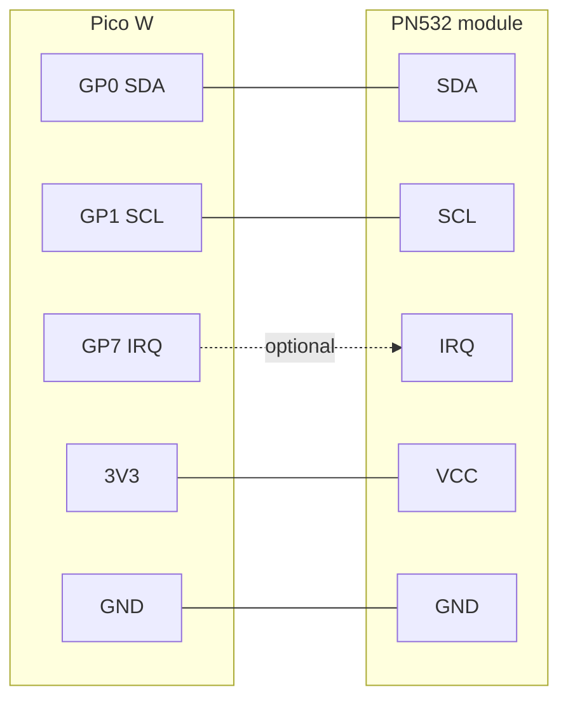
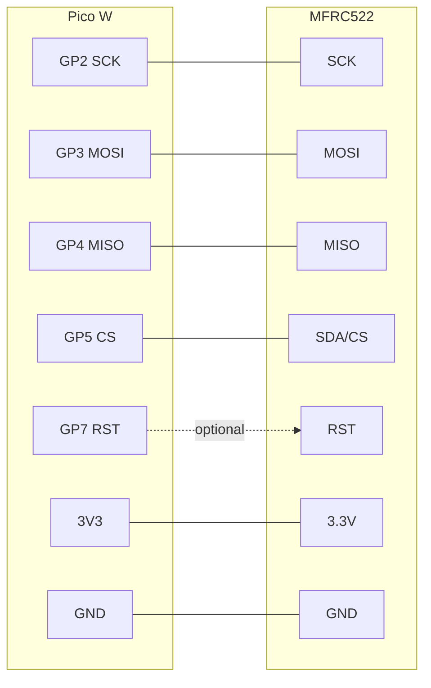
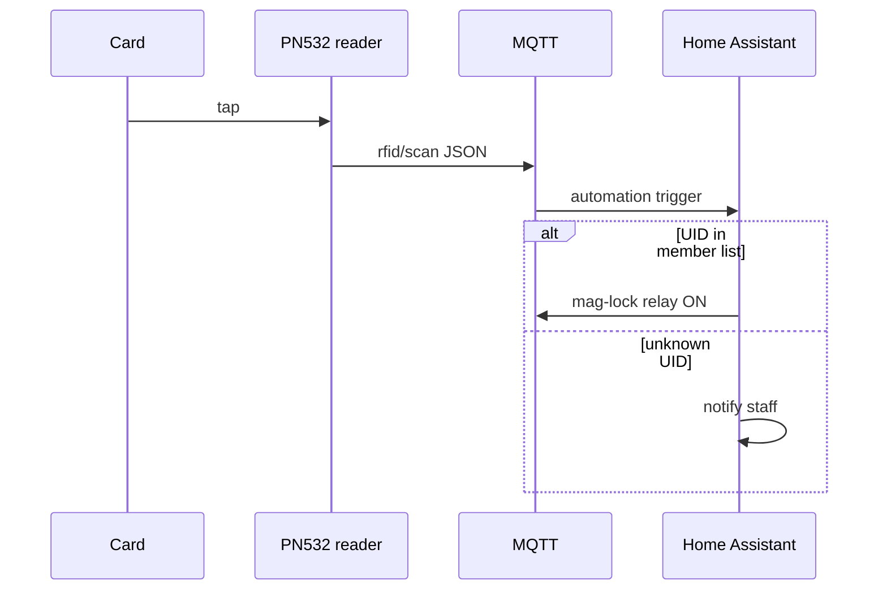

# RFID — member card reader

## Purpose

Read **13.56 MHz RFID/NFC member cards** (ISO14443A) at a zone entry and publish scan events to MQTT for **usage tracking** and future **access control**. Typical use: makerspace shop doors, tool crib check-out, and laser-room entry logs.

## Quick start

```bash
cp examples/rfid.yaml config.yaml
cp secrets.example.yaml secrets.yaml
# Edit mqtt.host, sensors.rfid.zone, reader address
```

**Pair / learn mode** (capture unknown UID at the reader):

```bash
mosquitto_pub -h 192.168.1.50 -t site/rfid-node-01/rfid/pair -m "ON"
```

Tap a card; the UID appears on `{base_topic}/rfid/scan` and `{base_topic}/rfid/last_uid/state`. Add known UIDs to HA helpers or `access.allowed_uids` when the access-control runtime ships.

## Hardware

| Item | Spec |
|------|------|
| **Board** | Raspberry Pi Pico W (`profile: sensors`) |
| **Reader (default)** | **PN532** on I2C — address **0x24** |
| **I2C bus** | I2C0 — SDA **GP0**, SCL **GP1** |
| **IRQ (optional)** | **GP7** — interrupt on card present |
| **Cards/tags** | MIFARE Classic, NTAG213/215/216, ISO14443A fobs |

### Reader alternatives

| `reader.type` | Bus | When to use |
|---------------|-----|-------------|
| **`pn532_i2c`** (default) | I2C GP0/GP1 | Best fit when SPI pins are used for relays (makerspace zone nodes) |
| `mfrc522_spi` | SPI GP2–5 | Cheapest modules; needs free SPI pins |
| `wiegand` | GPIO D0/D1 | Commercial wall readers (26/34-bit); see `reader.data0` / `reader.data1` |

This example enables **I2C** and defaults to **PN532** — the usual choice on Pico W zone nodes that already use SPI pin positions for machine relays.

## Bus wiring

### PN532 I2C (default)



Set the PN532 board jumper to **I2C** mode (often labeled `I0`/`I1` or `SEL0`/`SEL1` per module silkscreen).

### MFRC522 SPI (alternative)



Enable `buses.spi` and set `reader.type: mfrc522_spi` — only when those GPIO lines are not used for relays.

## MQTT / Home Assistant topics

Default `base_topic`: `site/rfid-node-01`

### Scan events (tracking)

| Topic | Payload | Notes |
|-------|---------|-------|
| `{base_topic}/rfid/scan` | JSON | Non-retained event per tap — `uid`, `zone`, `timestamp` |
| `{base_topic}/rfid/last_uid/state` | Hex UID string | Retained — last card at this reader |
| `{base_topic}/rfid/pair` | `ON` / `OFF` | Enable learn mode (runtime-defined) |

**Scan JSON example:**

```json
{"uid":"A1B2C3D4","zone":"woodshop","reader":"pn532_i2c","timestamp":"2026-06-28T12:34:56Z"}
```

### Access control (future / HA today)

| Topic | Payload | Notes |
|-------|---------|-------|
| `{base_topic}/rfid/access/granted` | `ON` | Published when UID passes allowlist (future firmware) |
| `{base_topic}/rfid/access/denied` | `ON` | Published when UID fails allowlist |
| `access.allowed_uids[]` | Hex strings | Empty = **track only**; HA enforces ACL via automations today |

**HA tracking pattern:** MQTT trigger on `rfid/scan` → log to `input_text` / Influx / spreadsheet webhook. Match UID against a member helper list for dashboards.

**HA access pattern (today):**



### Home Assistant entities

| Entity | Alias | Type |
|--------|-------|------|
| Last Card UID | `rfid_last_uid` | sensor (text) |
| RFID Scan Count | `rfid_scan_count` | sensor (total_increasing) |
| RFID Access Granted | `rfid_access_granted` | binary_sensor (lock) |

Device name from `sensors.rfid.ha.name` (e.g. **Entry RFID**).

## Design decisions

1. **PN532 on I2C default** — Makerspace zone nodes already use SPI pin positions (GP2–5) for machine relays; I2C shares the bus with future environmental sensors.
2. **`access.mode: track` initially** — Logs every tap without blocking; HA holds member ACL until firmware allowlist enforcement lands.
3. **Per-zone `zone` field** — Embeds shop name in scan JSON so one HA instance aggregates woodshop / welding / digifab traffic.
4. **800 ms debounce** — Ignores double-taps and card flutter at the reader.
5. **Retained `last_uid`** — Dashboards show who was last in the zone after node reboot (pair with motion/door sensors for presence).

## FAQ

**Q: MIFARE Classic vs NTAG — which cards?**  
A: Both are ISO14443A. NTAG213 stickers are cheap for member fobs; MIFARE Classic 1K is common on blue keyfobs. The reader publishes **UID only** — no sector auth in v1.

**Q: Can one reader control a mag-lock?**  
A: Not directly — use HA: valid UID on `rfid/scan` → pulse `entry_lock` relay (see club/makerspace commons patterns). Future `access.mode: allowlist` can publish `access/granted` from firmware.

**Q: PN532 vs MFRC522?**  
A: PN532 is more capable (NFC peer modes, better antenna tuning) and fits I2C without stealing relay pins. MFRC522 is fine on a **dedicated** RFID-only node with free SPI.

**Q: Wiegand wall reader?**  
A: Set `reader.type: wiegand` with `data0` / `data1` GPIO pins — common for commercial HID-style readers at the front door.

**Q: Is the RFID runtime implemented?**  
A: **Config contract** — same status as TPMS, level, and PWM examples. GPIO relays in makerspace configs run today; RFID topics define the integration surface for the next driver phase.

## Related

| Example | Why |
|---------|-----|
| [`sites/makerspace-woodshop.yaml`](examples/sites/makerspace-woodshop.yaml) | Woodshop zone + entry RFID |
| [`sites/makerspace-welding.yaml`](examples/sites/makerspace-welding.yaml) | Welding zone + entry RFID |
| [`sites/makerspace-digifab.yaml`](examples/sites/makerspace-digifab.yaml) | Digifab zone + entry RFID |
| [`sites/makerspace.md`](examples/sites/makerspace.md) | Multi-zone RFID tracking overview |
| [`sensors-i2c-onewire.yaml`](sensors-i2c-onewire.yaml) | I2C bus enablement |