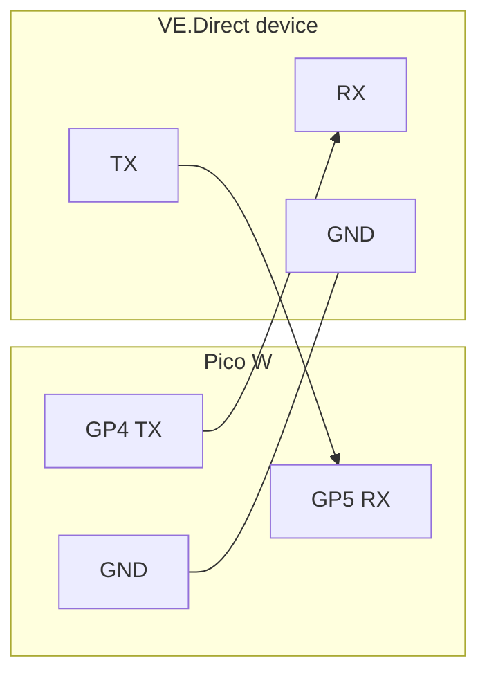

# Victron VE.Direct — UART energy monitor

## Purpose

Read **Victron VE.Direct** devices over a **point-to-point UART** link (not CAN, not RV-C) and publish battery/solar metrics to MQTT with Home Assistant discovery.

Typical devices: **SmartShunt**, **BMV-712**, **SmartSolar MPPT** (VE.Direct models), **Phoenix Inverter** (VE.Direct), **BatteryProtect**.

## Quick start

```bash
cp examples/victron-vedirect.yaml config.yaml
cp secrets.example.yaml secrets.yaml
# Edit mqtt.host, device IDs
# Wire VE.Direct TTL to Pico UART1 GP4/GP5 (or USB on Pi 4)
```

VE.Direct cable is **RJ45** on the Victron side — use the official **Victron VE.Direct USB** cable or a TTL adapter that matches pinout.

**Protocol reminder:** VE.Direct is **UART @ 19200 8N1**. It is **not** VE.Can and **not** RV-C.

## Hardware

| Item | Spec |
|------|------|
| **Board** | Raspberry Pi Pico W (`profile: maximum_gpio`) |
| **Interface** | `buses.ve_direct` — UART **1** |
| **TX / RX** | **GP4** (TX) / **GP5** (RX) |
| **Baud** | **19200** 8N1 |
| **Devices** | One VE.Direct port per physical cable |

### Supported products (examples)

| Product | Role |
|---------|------|
| SmartShunt / BMV-712 | House battery monitor |
| SmartSolar MPPT (VE.Direct) | Solar charger |
| Phoenix Inverter VE.Direct | Inverter status |
| BatteryProtect | Load disconnect monitor |

`product: auto` lets the runtime detect the connected Victron device type.

### Pi 4 alternative

Comment in YAML: use a **USB-serial adapter** on Pi 4 instead of Pico — adapt `board`, UART pins, and deployment model (Linux Python bridge pattern like [`jbd-bms.md`](jbd-bms.md) when implemented).

## Bus wiring

VE.Direct is **single-device UART** — one RJ45 port, one listener.



**RJ45:** Do not crimp random Ethernet cables — use Victron-approved VE.Direct USB or documented TTL breakout (multiple pinouts exist; wrong wiring damages neither side if current-limited, but data will not flow).

**Multi-device:** Each Victron VE.Direct port needs its own UART (or a VE.Direct USB hub / Cerbo GX). This config shows one device (`shunt_main` → `house_battery`).

## MQTT / Home Assistant topics

Default `base_topic`: `mobile/victron`  
Publish interval: **5000 ms** (`victron.ve_direct.publish.interval_ms`)

### Decoded fields

| VE.Direct key | Alias | Scale | HA name | Unit |
|---------------|-------|-------|---------|------|
| `V` | `battery_voltage` | ×0.001 | Battery Voltage | V |
| `I` | `battery_current` | ×0.001 | Battery Current | A |
| `SOC` | `battery_soc` | — | Battery SOC | % |
| `P` | `battery_power` | — | Battery Power | W |
| `TTG` | `time_to_go` | — | Time to Go | min |

State pattern: `{base_topic}/victron/{alias}/state` (retained)

### Home Assistant discovery

Device block from config:

- Device name: **House Battery**
- Manufacturer: Victron Energy
- Parent device: **Victron VE.Direct** (`device.ha.name`)

```
homeassistant/sensor/{device_id}_battery_voltage/config
homeassistant/sensor/{device_id}_battery_current/config
…
```

## Design decisions

1. **UART not CAN** — VE.Direct is a text/binary hybrid serial protocol on dedicated RJ45 ports. Do not connect these pins to a CAN transceiver.
2. **19200 baud** — Victron factory default for VE.Direct; unlike JBD @ 9600 ([`jbd-bms.md`](jbd-bms.md)).
3. **Scale on `V` and `I`** — Raw VE.Direct integers scaled to engineering units in YAML (`0.001`) so HA gets volts/amps directly.
4. **5 s publish cadence** — Matches typical VE.Direct update rate without flooding MQTT.
5. **Separate from VE.Can** — Lynx Shunt / MPPT **VE.Can** models need [`victron-vecan.yaml`](victron-vecan.yaml) on a **250k CAN** tap — different cable, decoder, and topics.
6. **Separate from RV-C** — Coach lighting/HVAC RV-C bus is unrelated; see [`can-rvc.md`](can-rvc.md).

## FAQ

**Q: VE.Direct vs VE.Can — which does my shunt use?**  
A: Check the label and ports. **VE.Direct** = RJ45 serial (this doc). **VE.Can** = NMEA 2000-style CAN at 250k ([`victron-vecan.md`](victron-vecan.md)). Some installs have both on different products.

**Q: Can I read MPPT and SmartShunt on one UART?**  
A: **No** — one VE.Direct cable per device. Use multiple UARTs, a Cerbo GX, or VE.Can for bussed devices.

**Q: Is VE.Direct the same as RV-C?**  
A: **No.** RV-C is a coach multiplex CAN protocol ([`can-rvc.md`](can-rvc.md)). Victron energy data does not appear on RV-C unless a gateway (e.g. Cerbo) bridges it.

**Q: Why Pico W instead of Pi for Victron?**  
A: Low-power wall-mounted node near the distribution panel. Pi + USB VE.Direct is equally valid when Python host support exists.

**Q: What if I only have CAN on my Victron gear?**  
A: Skip this file — use [`victron-vecan.yaml`](victron-vecan.yaml) with an MCP2515 or can2040 tap on the VE.Can bus.

## Related examples

| Example | Relationship |
|---------|--------------|
| [`victron-vecan.md`](victron-vecan.md) | Victron CAN @ 250k (NMEA 2000 family) |
| [`sites/rv-victron.yaml`](sites/rv-victron.yaml) | Combined Victron + RV-C site |
| [`jbd-bms.md`](jbd-bms.md) | JBD pack UART (parallel battery data) |
| [`can-rvc.md`](can-rvc.md) | Coach RV-C (not Victron) |

## Implementation status

| Component | Status |
|-----------|--------|
| `examples/victron-vedirect.yaml` | **Config contract** |
| VE.Direct UART parser | **Not implemented** |
| Multi-device / auto product detect | **Not implemented** |
| HA discovery publish | **Not implemented** |

**Config contract only** on Pico W. For a working UART bridge pattern in this repo, see **JBD BMS** ([`jbd-bms.md`](jbd-bms.md)) — different protocol, same deployment idea on Linux.